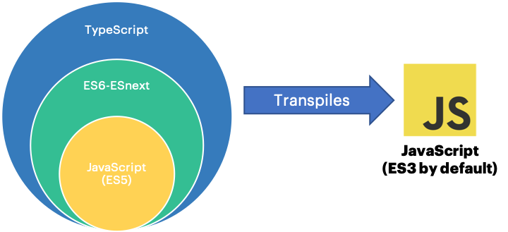

# TypeScript

TypeScript is a **typed superset** of JavaScript that compiles to plain JavaScript.



***But, why Typescript?***

With TypeScript we can have JavaScript features from the future, today!. In addition, TypeScript have a powerful type system that gives us:

* Autocompletion.
* Type checking.
* Detection of errors at compilation time instead of runtime.
* Easy refactoring.
* Source documentation.

Let's drive into the most common features from TypeScript used in Angular applications.

## Basic Types

**Boolean.** The most basic datatype is the simple true/false value.

```ts
let isDone: boolean = false;
isDone = true; //Correct
isDone = 'hi'; //Error: '"hi"' is not assignable to type 'boolean'.
```

In the above code example we declare the variable `isDone` with a boolean type, if at some point by mistake we try to assign to `isDone` a non-boolean value (like a string), then TypeScript will notify us the error.

**Number.** All numbers in TypeScript are floating point values. TypeScript also supports binary, octal and hexadecimal.

```ts
let decimal: number = 6;
let float: number = 0.125;
let hexa: number = 0xf00d;
let binary: number = 0b1010;
let octal: number = 0o744;
```

**String.** Just like JavaScript, TypeScript also uses double quotes (`"`) or single quotes (`'`) to surround string data, and template literals (`) to embed expressions.

```ts
let color: string = 'blue';
color = "red";
const employeeId: number = 1234;
const message: string = `The employee id is ${employeeId}`;
```

**Array.** Array types can be written in two ways: using type of the elements followed by `[]` or using a generic array type: `Array<elemType>` (Generic types will be covered later).

```ts
let list: number[] = [1, 2, 3];
let list: string[] = ['first', 'second', 'third'];
let list: Array<boolean> = [true, false, true];
```

**Enum.** Enum is a way of giving more friendly names to sets of numeric values. By default, enums start at 0, but values can be set manually.

```ts
enum Color {Red, Green, Blue};
let c: Color = Color.Green;
enum Color {Red = 1, Green = 2, Blue = 4};
```

**Any.** Sometimes applications or data sources don't give us enough information on what data types is the one we're getting. TypeScript manages a universal data type called `any`.

```ts
let notSure: any = 4;
notsSure = 'maybe a string';
notSure = false;
```

> *Note:* Using `any` eliminates any kind of type rules and reverts to the weakly typed JavaScript, so it should really be **avoided**.

**Other types.** Less common types are:

| Type           | Description                                                                       |
|----------------|-----------------------------------------------------------------------------------|
| void           | The absence of any type, commonly used on functions that do not return a value    |
| null/undefined | Same as JavaScript, subtypes of all other types                                   |
| never          | Indicates the values that will never occur                                        |
| object         | Represents the non-primitive type                                                 |
| unknown        | Type-safe, no operations permitted without first asserting or narrowing to a type |

## Advanced Types

**Custom types.** Basic types can be combined to create more advanced types. In the next example we declare the variable `user` to be an object with the properties `nickname` and `points`, so if later by mistake we try to assign `email` to the object, TypeScript will complain.

```ts
let user: {nickname: string, points: number};
user = {
 nickname: 'snow',
 points: 15,
 email: 'some@email.com' //Error: 'email' does not exist in type '{ nickname: string; points: number; }'.
}
```

**Type aliases.** Custom types can be reused by creating a new name for a type. In the next example we extract the object with the properties `nickname` and `points`, and we assign it a name (`User`), then we just use the name of the type instead of declaring the type whenever is required.

```ts
type User = {nickname: string, points: number};

const activeUser: User = {
 nickname: 'tobi',
 points: 15
}
const inactiveUser: User = {
 nickname: 'obito',
 points: 23
}
```

**Union types.**  A union type (`|`) describes a value that can be one of several types. In the next example the second function parameter can be a string or number, so if a different type is sent will cause a TypeScript error.

```ts
function padLeft(value: string, padding: string | number) {}
padLeft('hello', '  '); //Correct
padLeft('hello', 3);    //Correct
padLeft('hello', true); //Error: type 'true' is not assignable to parameter of type 'string | number'
```

**Interserction types.** An intersection type (`&`) combines multiple types into one. Let's assume that we already created types for `Contact` and `Address`, now we need a function parameter with information of both types, instead of creating a new type including all the properties, we can merge the types with an intersection type `&`.

```ts
type Contact = {
 phone: string,
 email: string,
};
type Address = {
 city: string;
 country: string;
};
function logUserInfo(userInfo: Contact & Address) {
 console.log(`User with email ${userInfo.email} is from ${userInfo.country}`);
}
```

**Literal types.** Allows us to specify the exact values that a type must have. They are very useful when the possible values for a variable are few and we know the values beforehand.

```ts
type ScrollBehavior = 'auto' | 'instant' | 'smoth';
const scrollTo = (top: number, behavior: ScrollBehavior) => {}
scrollTo(100, 'smoth'); //Correct
scrollTo(100, 'none');  //Error: 'none' is not allowed here
```

## Clasess and Interfaces

**Classes.**
Classes in JavaScript were introduced in ECMAScript 2015 (ES6) as syntatical sugar over JavaScript's existing prototype-based inheritance, that means that only modern browsers sopport them. With TypeScript, Classes will transpile down to ES3 to maintain compatibility with all versions of browsers and platforms.

```ts
class Animal {
 name: string;
 move(distance: number = 0) {
  console.log(`Animal moved ${distance}m`);
 }
}
```

**Inheritance.** One of the most fundamental patterns in object-oriented approach is being able to extend other classes.
The next code snippet shows an example where Dog is a subclass that derives from the Animal base class using the `extends` keyword, then `Dog` can use properties and methods from the `Animal` class:

```ts
class Dog extends Animal {
 bark() {
   console.log('Woof! Woof!');
 }
}
const dog = new Dog();
dog.name = 'Daisy';
dog.bark();
dog.move();
```

**Public, private, and protected modifiers.**
If you're familiar with classes in other programming languages, you may have noticed we haven't had to use access modifiers: In TypeScript, each member is `public` by default.

| Access Modifier | Description                                                                      |
|-----------------|----------------------------------------------------------------------------------|
| public          | Members can be accessed outside of the class                                     |
| private         | Members cannot be accessed from outside of the class                             |
| protected       | Similar to private, but protected members can also be accessed within subclasses |

```ts
class Greeter {
 private greeting: string;
 constructor(message: string) {
  this.greeting = message;
 }
 public greet() {
  return 'Hello, ' + this.greeting;
 }
}
let greeter: Greeter = new Greeter("world");
greeter.greet();  //Correct
greeter.greeting; //Error: Property 'greeting' is private and only accessible within class 'Greeter'.
```

**Interfaces**. Interfaces are a way to declare complex data structures, they are declared in a similar way as a class does but interfaces only have declarations and no implementation details.

```ts
interface ClockInterface {
 currentTime: Date;
}

const clock1: ClockInterface = { //Correct
 currentTime: new Date()
}
const clock2: ClockInterface = {} //Error: Property 'currentTime' is missing in type '{}' but required in type 'ClockInterface'
}
```

One of the most common uses of interfaces in object-oriented programming languages is to enforce that a class meets with a particular contract, that is also possible in TypeScript:

```ts
interface ClockInterface {
 currentTime: Date;
 setTime(d: Date): void;
}

class Clock implements ClockInterface { //Correct: Class 'Clock' accurately implements the interface
 currentTime: Date = new Date();
 constructor(h: number, m: number) { }
}

class Countdown implements ClockInterface {} //Error: Type 'Countdown' is missing the properties: currentTime, setTime
```

## Generics

A good practice in software engineering is to create components that are reusable, reducing repetition (DRY), so its common to create components that can work over a variety of types rather that a single one.
For example, let's create a Stack data structure:

```ts
class Stack {
 private stack: any[] = [];
 push(item) {
  this.stack.push(item);
 }
 pop() {
  return this.stack.pop();
 }
}
const stack = new Stack();
stack.pushItem(1);   //Valid
stack.pushItem('2'); //Valid, but developer mistake
stack.pushItem({});  //Valid, but developer mistake
```

This example above is a class that contains a stack of values of `any` type, so when we instantiate the class, the stack object allows us to mix different types in the same structure, in most cases this will cause a number of problems and the errors will be detected until runtime.

**Generics.** Generics allows us to capture the type the user provides so that we can use that information to keep consistency.
Let's re-create the Stack using Generics:

```ts
class Stack<T> {
 private stack: T[] = [];
 push(item: T) {
  this.stack.push(item);
 }
 pop(): T {
  return this.stack.pop();
 }
}
```

This class can be understood as follows:

* Stack is a stack of values that all have a given type `T`. You must fill in `T` whenever you use Stack. We'll see how, next.
* Method `.push()` accepts values of type `T`.
* Method `.pop()` returns values of type `T`.

If you use Stack, you must assign a type to `T`. In the following code snippet we create a Stack of numbers, and by doing so, only numbers will be accepted, if we try to assign a different type from number TypeScript will throw a compilation error:

```ts
 const stack = new Stack<number>();
 stack.push(1);   //Correct
 stack.push('2'); //Error: type '"2"' is not assignable to parameter of type 'number'.
 stack.push({});  //Error: type '{}' is not assignable to parameter of type 'number'.
```

This will save us a lot of time, since the cost of solving a compilation error is far less than solving it at runtime.

## Type Inference

You may be thinking that it's a tedious task to write types for all variables or members, however, there are several places where TypeScript can infer the types without an explicit annotation.

Let's take a look to the next code: since variable `x` is initialized with a number, the type of the variable is inferred to be number. If we try to assign a different type, TypeScript will complain.

```ts
let x = 3; //Inferred type: let x: number;
x = 10;    //Correct
x = true;  //Error: Type 'true' is not assignable to type 'number'.
```

However, if we don't initialize the variable when we declare it, the infferred type will be `any`:

```ts
let x;
x = 3;
x = true;
x = {};
```

So we need to be cautious and recognize when a type can be inferred.
Types are inferred for:

* **Initialized variables**
* **Function return types**
* **Parameters with default values**.

Let's take a look to the next example:

```ts
function removeEmpty(list) {
  return list.filter(word => word.trim() !== '');
}
```

Since we don't added the type for the function parameter, nor the type that will return the function, then the function will be inferred as:

```ts
function removeEmpty(list: any): any
```

Let's fix that by adding the type for the function parameter:

```ts
function removeEmpty(list: string[]) {
  return list.filter(word => word.trim() !== '');
}
```

Now the funcion is inferred as:

```ts
function removeEmpty(list: string[]): string[]
```

*How was the return type inferred?*

TypeScript knows the types of all the JavaScript built-in objects (in JavaScript [Array is an object](https://developer.mozilla.org/en-US/docs/Web/JavaScript/Reference/Global_Objects/Array)), and therefore knows that the `.filter` method of an Array creates a new array of the same type, and since the type of the array is `string[]`, then is concluded that `string[]` is also the return type.

***
Here we covered common TypeScript features, for additional information check any of the following resources:

* [Handbook: The TypeScript language reference](https://www.typescriptlang.org/docs/handbook/basic-types.html)
* [TypeScript Deep Dive](https://basarat.gitbooks.io/typescript/docs/getting-started.html)
* [TypeScript Progression Ladder](http://www.techladder.io/?tech=typescript)
* [Understanding TypeScript’s type notation](https://2ality.com/2018/04/type-notation-typescript.html)
