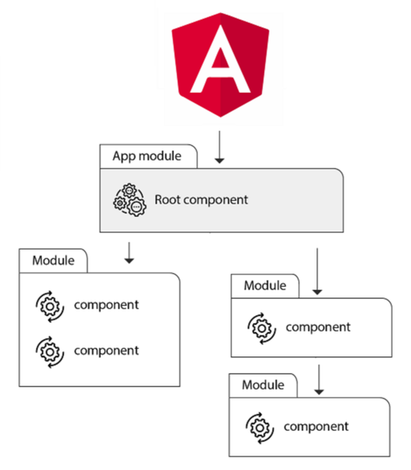

# **Modules And Components**
<div style='max-width: 768px; text-align: justify'>

**Modules** are the basic building block of an angular application, they `provide a compilation context for components`. They help you manage the structure and bring modularity to your application.

**Components** are the `view of the application`, they connect and communicate with services and other components to provide functionality to the app.

> You can learn more about Angular Architecture [here](https://angular.io/guide/architecture).

***
## **Modules**
Modules in Angular are denoted by ***@NgModule*** decorator, these NgModules collect code into functional sets, this means that an Angular app is a set of NgModules.  
The typical structure of an app is to have a *root module* that bootstraps the application (tipically AppComponent), and some *feature modules* that provide other functionalities.

Basic structure of a Module:
```ts
@NgModule({
  declarations: [ AppComponent, DashboardComponent ],
  imports: [ BrowserModule ],
  providers: [ AppService ],
  bootstrap: [ AppComponent ],
})
export class AppModule {}
```

You can see that the ngModule has a metadata object that describes what the module contains, the most important properties are:
| Property | What is declared here? |
| - | - |
| declarations | components, pipes and directives inside this module |
| imports | other modules that have classes needed by components in this module |
| exports | declarations that can and will be used in other modules |
| providers | services |
| bootstrap | main view (root component), this should be only declared in the root module |

> You can learn more about Modules [here](https://angular.io/guide/architecture-modules).

***
## **Components**
Components define a class that contains data and logic assoaciated to an HTML template to create the view to be displayed in a target environment, this means that is a combination of methods, properties and an html that is going to be displayed in a web or mobile browser.

> Angular creates, updates, and destroys components as the user moves through the application.

Components are denoted by ***@Component*** decorator. As modules, they also contain metadata that tell Angular where to get building blocks needed to create and render the component and its view. 

Here's an example of the basic structure of a component with the most important metadata:
```ts
@Component({
  selector:    'app-dashboard', // How the component is called through the app
  templateUrl: './dashboard.component.html', // Path to the template file
  styleUrls: ['./dashboard.component.scss'], // Path to the styles file to be used
})
export class DashboardComponent {}
```

It is recommended to have the template, styles, and logic in separated files to have a better organization, however, you can declare the template and style inside the component decorator.  
This would be an example:
```ts
@Component({
  selector: 'app-login',
  template: `
    <div class="container">
      <label for="user">Username</label>
      <input type="text" placeholder="Enter Username" name="user" required>

      <label for="psswd">Password</label>
      <input type="password" placeholder="Enter Password" name="psswd" required>
      
      <button type="submit" class="btn">Login</button>
    </div>
  `,
  styles: `
    .container {
      padding: 15px;
    }
    .btn {
      background-color: #f52614;
      color: white;
    }
  `,
})
export class LoginComponent {}
```

> **Note**: You have to change the property used since it is not a reference to another file anymore. In this case we changed ***templateUrl*** to **template** and ***styleUrls*** to **styles**.  
**Tip**: Use backtick ( ` ) for multiline code.

> You can learn more about Components [here](https://angular.io/guide/architecture-components).

***
## **Components and Modules together**
As we discussed before, the root ngModule (conventionally called AppModule) always has the root component that is created during bootstrap, but any Module created can have any number of additional components, and you can have as many modules as you need.  
> The components that belong to an ngModule share a [compilation context](https://basarat.gitbooks.io/typescript/content/docs/project/compilation-context.html "Definition").



***
## **Angular CLI**
You can use Angular CLI to create Modules and Components as well as many other Angular elements.  
It is a great tool because it helps you import whatever you are creating in the right module, it declares and creates the basic properties for components, and it can help you in case you forget the basic stucture any Angular element needs to have.

To use Angular CLI, you have to install it:

```sh
npm install -g @angular/cli
```
Once it is done, you have to create a project
```sh
ng new my-project
```
After you create the project, then you can start creating your own elements
```sh
ng generate module moduleName [options]
ng generate component componentName [options]

ng generate <element> <name> [options]
```
> **Note**: To learn more about the options when creating, check [documentation](https://angular.io/cli/generate).  
> **Tip**: There are some abbreviations you may use when creating elements with CLI.  
Example: ***ng g c componentName***, ***ng g s serviceName***, etc.

> You can learn more about Angular CLI [here](https://cli.angular.io/).

***
Start building your own Angular applications!  
In case you need something else, check any of the additional resources:

- [Angular Documentation](https://angular.io/api)
- [Modules](https://angular.io/api/core/NgModule)
- [Components](https://angular.io/api/core/Component)
- [Angular CLI](https://angular.io/cli)

</div>