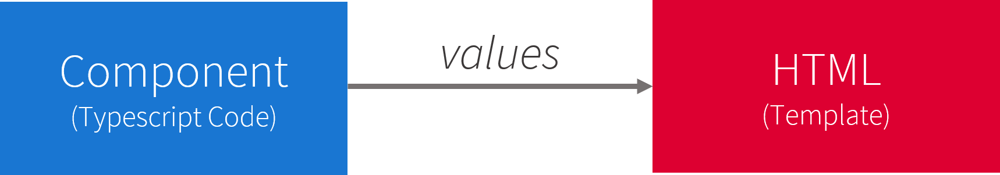
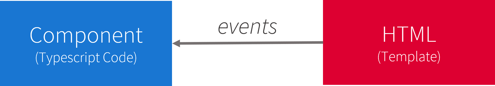
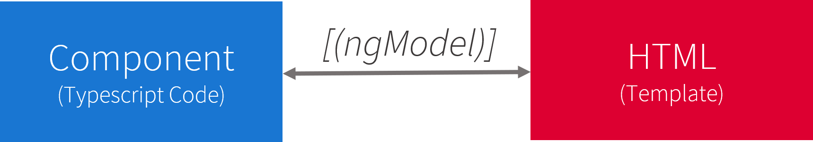

# Data Binding
This is the mark down for the data interpolation and binding presentation. 

*comentary*: italics represent notes from the presenter. 

---
## Slide 1: 
### Data Binding is the way we connect our logic and data to our template(view).



*Angular Data Binding or Data interpolation can be easeier to understand if we think about it as the way that we connect our logic and data to our template. There are different ways to communicate the template to our logic. In this presentation we will explore those forms of communication*

---
## Slide 2:
### Types of Data manipulation:

- String Interpolation
- Property Binding
- Event Binding
- Two-Way-Binding

*Angular has 3 different ways that we can manipulate data in our template, string interpolation that uses double curly braces {{}}, property binding which uses brackets [] to bind data to html properties, and event binding which uses parenthesis () to trigger events from our component*

---
## Slide 3 :
### String Interpolation

String Interpolation is a one-way data-binding which is used to output the data from a TypeScript code to HTML template (view). 
It uses the template expression in double curly braces  `{{ propertyName }}`  to display the data from the component to the view..

Code Example: 
```html
<h3>My property label: {{ componentProperty1 }}</h3>
```
```ts
export class StringInterpolationComponent implements OnInit {
    componentProperty1 = 'Hello World';

    constructor () {}
}
```
Your rendered template would read:
<pre>
    <h3>My property label: 'Hello World'</h3>
</pre>

*Between the HTML tags we have a text followed by the double curly brace and inside it a component property name. Angular replaces the name of the property with the value of the corresponding property.*

---
## Slide 4 :
### String Interpolation

Code Example: 

```html
<h3>Name: {{ name }}</h3>
<p>age: {{ age }}</p>
```
```ts
export class StringInterpolationComponent implements OnInit {
    name = 'Carlos Gonzalez';
    age = 25;

    constructor () {}
}
```
Your rendered template would read:
<pre>
    <h3>Name: Carlos Gonzalez</h3>
    <p>Age: 25</p>
</pre>

*Here we have another example of string interpolation with real property names. Even number type variables will be rendered on the template.*

---
## Slide 5 :
### String Interpolation

Code Example: 

```html
<h3>Name: {{ name }}</h3>
<p>Sum of 1 + 1 = {{ 1 + 1}}</p>
<p>age: {{ age + 10 }}</p>
```
```ts
export class StringInterpolationComponent implements OnInit {
    name = 'Carlos Gonzalez';
    age = 25;

    constructor () {}
}
```
Your rendered template would read:
<pre>
    <h3>Name: Carlos Gonzalez</h3>
    <p>Sum of 1 + 1 = 2</p>
    <p>age: 35</p>
</pre>

*The text between the braces is a template expression that Angular first evaluates and then converts to a string and renders in the application. This allows the developer to do more with string interpolation.*

---
## Slide 6 :
### String Interpolation

Code Example: 

```html
<h3>Render value of method {{ getVal()}}</h3>
<h3>Render value of method with parameter: {{ getParamValue(1)}}</h3>
```
```ts
export class StringInterpolationComponent implements OnInit {
    stringByIndex = {
        1: 'value example 1', 
        2: 'value example 2',
    }

    constructor () {}

    getVal() {
        return 2;
    }

    getParamValue(index) {
        return stringByIndex[index];
    }
}
```
Your rendered template would read:
<pre>
    <h3>Render value of method 2</h3>
    <h3>Render value of method with parameter: value example 1</h3>
</pre>

*For example string interpolation can call methods within the component and render the result of that method. This implementation will be triggered on any dom event which can become expensive for memory with complex methods. Directives and pipes might be better for some solutions*

---
## Slide 7 :
### String Interpolation Don'ts

Code Example: 

```html
<h3>Don't render objects unless its a property of the object: {{ objectProp }}</h3>
<h3>Don't do if blocks: 
    {{ 
        if(val){ 
            return doSomething() 
        }
    }}</h3>
<h3>Don't do for blocks: 
    {{ 
        for(let x; x>10; x++){ 
            return x
        } 
    }}}</h3>
<h3>Don't create methods in template: 
    {{ 
        doAnything(val){ 
            return val + 10
        } 
    }}</h3>
```

*There are restrictions for the string interpolation. As the name suggest properties or methods inside the curly braces have to return strings, so objects will render as `[object,Object]` and booleans will return the string value of the boolean. Another restriction of the string interpolation is that developers can't write multi-line expressions, block expressions or add an if or for loop. Although ternary operators could be used*

---
## Slide 8 :
### String Interpolation on HTML properties

Code Example: 

```html

<button disabled="{{isDisabled}}">Cancel</button> 
```
```ts
export class StringInterpolationComponent implements OnInit {
    imgSrc = 'https://media.giphy.com/media/1kkxWqT5nvLXupUTwK/giphy.gif'
    isDisabled = true;

    constructor () {}
}
```
Your rendered template would read:
<pre>
    
    <button disabled>Cancel</button> 
</pre>

*String interpolation can be used to set data on the HTML properties. When this scenario occours sometimes is  better to do Property Binding*

---
## Slide 9 :
### Property Binding

Property binding is one-way data binding, where we bind a property of a DOM element to a field which is a property we define in our component typescript code. Angular converts string interpolation into property binding when working with DOM properties.

```html

 
```
Property binding is cleaner and shorter syntax to bind data to DOM properties.

---
## Slide 10 :
### Property Binding
Code Example: 

```html

<button [disabled]="isDisabled">Cancel</button> 
<h1 [style.color]="blue">This is a Blue Heading</h1>
```
```ts
export class PropertyBindingComponent implements OnInit {
    imgSrc = 'https://media1.giphy.com/media/jkSvCVEXWlOla/giphy.gif'
    isDisabled = false;

    constructor () {}
}
```
Your rendered template would read:
<pre>
    
    <button>Cancel</button>
    <h1 style="color:blue;">This is a Blue Heading</h1>
</pre>

*The example as we did it for interpolation can be changed to use data binding. This makes it easier to read and cleaner for other developers. We would havea similar result to our previous example but if the button disable property was turned to false the example using interpolation would not change disabled.*

---
## Slide 11 :
### Property Binding
Code Example: 

```html
<button [disabled]="(sendStatus !== 'enabled')">Send</button>
<button [disabled]="cancelCount > 7">Cancel</button>
<button [disabled]="nextIsDisabled()">Next</button>
```
```ts
export class PropertyBindingComponent implements OnInit {
    sendStatus = 'enabled';
    cancelCount = 10;

    constructor () {}
    nextIsDisabled() {
        return false;
    }
}
```
Your rendered template would read:
<pre>
   <button>Send</button>
   <button disabled>Cancel</button>
   <button>Next</button>
</pre>

*For property binding we can apply the same rules as interpolation, we can call methods and do calculations that Angular will render into the property data.*

---
## Slide 12 :
### Property Binding
Code Example: 

```html
<div [ngClass]="classes">[ngClass] binding to the classes property</div>
<app-my-component [componentData]="componentData"></app-my-component>
```
```ts
export class PropertyBindingComponent implements OnInit {
    classes = 'row larger-row';
    componentData = 'Fantastic';

    constructor () {}
}
```
Your rendered template would read:
<pre>
    <div class="row larger-row">[ngClass] binding to the classes property</div>
    <div>
        My Component is Fantastic
    <div>
</pre>

*Other ways to use property binding is to bind ot properties like classes or specific to the HTML tag. We also use property binding for attributes known as `Input()` from other component which then will be rendered as the full component with the data of the property that was set in my parent component. This is one of the main methods of communication between components.*

---
## Slide 13 :
### Event Binding

Event binding is defined as the updating/sending of the value/information of a certain variable from the presentation layer (view) to the component (model). 



Angular event binding syntax consists of a target event name within parentheses `(eventProperty)="actionToTake()"` on the left of an equal sign, and a quoted template statement on the right. 

*In an event binding, Angular sets up an event handler for the target event. When the event is raised, the handler executes the template statement. The template statement typically involves a receiver, which performs an action in response to the event, such as storing a value from the HTML control into a model. The binding conveys information about the event. This information can include data values such as an event object, string, or number named \$event.The target event determines the shape of the $event object. If the target event is a native DOM element event, then $event is a DOM event object, with properties such as target and target.value.*


---
## Slide 13 :
### Event Binding
Code Example: 

```html
<a (click)="clickMethod('clicked')">Click Me<a>
<form (submit)="onSave()">Save</form>
    <input (keyup)="onPressEnter($event)"/>
    <input (keyup.enter)="onPressEnterWithNoFilter($event)"/> 
    <button type="submit" >Cancel</button>
    <button (click)="onCancel($event)">Cancel</button>
</form> 
```
```ts
export class EventBindingComponent implements OnInit {
    iWasClicked = false;
    constructor (private saveEndpoint: SaveService) {}
    clickMethod(eventStatus) {
        if(eventStatus === 'clicked'){
            this.iWasClicked = true;
        }
    }

    onSave(){
        return this.saveEndpoint.post()
    }

    onCancel(event){  
        console.log("Save button is clicked!", event);  
    } 

    onPressEnter(event){  
        if(event.keyCode===13){  
            console.log("Entered text: ",event.target.value);  
        }  
    }
    onPressEnterWithNoFilter(event) {
        console.log("Entered text: ",event.target.value); 
    }  
}
```

*On the examples we have for event binding the parentheses with the template property is then attached to a method from the component. That means that when the link "Click Me" is clicked it will trigger the clickMethod in the component. This method takes the attribute from the template in its parameter and then is manipulated to change the iWasClicked attribute to true. With the same principle the form input and buttons are also doing something when an event property that is binded its triggered, but it could be used for any template property. The Event bind also has properties which can be obtained with the $event declaration on the paramenter. This way we can get information from that event for example with the keyup we have a key code, so when the key is pressed on that input we could filter by a specific keyCode. although for keyup events we can actually filter directly on the event bind.*

---
## Slide 13 :
### Event Binding
Code Example: 

```html
<app-my-component (saveForm)="saveFormMethod($event)"></app-my-component>  
```
```ts
export class EventBindingComponent implements OnInit {
    constructor (private saveEndpoint: SaveService) {}
    saveFormMethod(myComponentForm: BigForm){
        this.mapData(myComponentForm);
        if (myComponentForm.isGreat) {
            myComponentForm.greatnesStaus = true
        }
        this.saveEnpoint.post(myComponentForm);
    }
}
```

*Another way to use event binding in when a component outputs information with its `Output()` decorator. This will be explored if future sessions but basically a component emits an event to which we can bind and the $event information is whatever is sent from that component to its parent component.*

---
## Slide 14 :
### Two Way Data Binding 

Angular offers a special two-way data binding syntax for this purpose, `[(x)]`. The `[(x)]` syntax combines the brackets of property binding, `[x]`, with the parentheses of event binding, `(x)`.

[( )] = BANANA IN A BOX

> Visualize a banana in a box to remember that the parentheses go inside the brackets.



---
## Slide 15 :
### Two Way Data Binding 
Two-way data binding combines the input and output binding into a single notation using the ngModel directive.

```html
<input [(ngModel)]="name" > 
```
Behind the scenes what is actually expressed is:

```html
<input [ngModel]="name" (ngModelChange)="name=$event">
```

*Two-way data binding is pretty rare in angular and usually for inputs on template driven forms. Although Angular has a form builder and controller which are preffered for more complex forms.*


---
## Slide 15 :
### Two Way Data Binding 
Counter Component:
```html
<div>
  <p>
    <ng-content></ng-content>
    Count: {{ count }} -
    <button (click)="increment()">Increment</button>
  </p>
</div>
```
```ts
export class CounterComponent {
  @Input() count = 0;
  @Output() countChange = new EventEmitter<number>();

  constructor() {}

  ngOnInit() {}

  increment() {
    this.count++;
    this.countChange.emit(this.count);
  }
}
```

ParentComponent :
```html
<app-counter [(count)]="number1">Number 1:</app-counter>
<app-counter [count]="number2" (countChange)="number2=$event">Number 2:</app-counter>
<app-counter [count]="number3" (countChange)="onCountChanged($event)">Number 3:</app-counter>
```
```ts
export class AppComponent {
  number1: number;
  number2: number;
  number3: number;
  number4: number;

  constructor() {
    this.number1 = 0;
    this.number2 = 0;
    this.number3 = 0;
    this.number4 = 0;
  }

  onCountChanged(value: number) {
    this.number3 = value;
    this.number4 = value;
  }
}
```

*To create your own component that supports two-way binding, you must define an @Output property to match an @Input, but suffix it with the Change. The code example below, inside class CounterComponent shows how to make property count support two-way binding.*