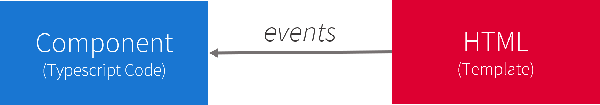
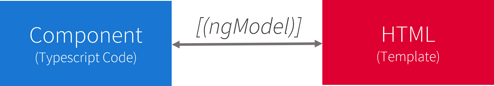

# Introduction to Data Binding and Data Interpolation

## **What is Databinding?**

It is the technique with which we connect our components (typescript) and their templates (html). This way we keep a separation between business logic and the view.  


[Angular](https://angular.io/guide/displaying-data) provides various types of data binding: 

- String Interpolation `{{}}`
- Property Binding `[property]="data"`
- Event Binding `(event)="expression"`
- Two-Way-Binding  `[(ngModel)]="data"`

Data-binding can be one-way or two-way. Angular has 3 one-way data binding techniques: `string interpolation` , `property binding` and `event binding`. The only two-way communication is through `ngModel`.

## **String Interpolation**

[String Interpolation](https://angular.io/guide/template-syntax#interpolation-and-template-expressions) is a one-way data-binding strategy which is used to **output** the data from a TypeScript code to HTML template (view). 
It uses the template expression in double curly braces  `{{ propertyName }}`  to display the data from the component to the view.


### **String Interpolation Code Examples:**
In out first example we have a component called `StringInterpolationComponent` which has a property named `componentProperty1`. The property of our component has the inital value of ```'Hello World'```.

```ts
export class StringInterpolationComponent implements OnInit {
    componentProperty1 = 'Hello World';

    constructor () {}
}
```
Then that component would have a template either on the same component decorator or on another file. with the following html code.
```html
<h3>My property label: {{ componentProperty1 }}</h3>
```
When the code is rendered what you would see on your page would be something like this:
<pre>
    <h3>My property label: 'Hello World'</h3>
</pre>

Angular has now replaced the name of the property with the value of the corresponding property.

### **String Interpolation Common Applications:**
Since the text between the braces is a template expression that Angular first evaluates and then converts to a string and renders in the application. This allow us to do more with string interpolation.

```ts
export class StringInterpolationComponent implements OnInit {
    title = 'Student Profile';
    firstName = 'Peter';
    lastName = 'Parker';
    age = 25;
    profilePictureUrl = 'string-interpolation-profile-picture.jpg';
    quote = 'With a great power comes a great responsibility';
    quoteStyle = 'color: red;'

    constructor (private studentGrades: StudentGradesService) {}

    getStudentStatus(){
      // We could do complex solution that returns the student status
      return 'Accepted'
    }

    getStudentGrades(studentId) {
      if(studentId){ 
        // we are calling a service to retrive information that we want to display in the template
        return this.studentGrades.getStudentGrade(studentId)
      }
    }
}
```
```html
<h2>{{title}}</h2>
<p>name: {{firstName}} {{lasttName}}</p>
<p>age: {{ age + 1 }}</p>
<div></div>
<q style="{{quoteStyle}}">{{quote}}</q>
<p>status: {{ getStudentStatus() }}</p>
<p>avg grade: {{ getStudentGrades(101) }}</p>
```
In the code above we have several examples with more real properties and methods that would be similar to a real world implementaiton:
- First we are displaying the title with simple interpolation. 
- After that we are displaying the full name of the student, with two interpolations in the same lin, although this could also be a single line `{{firstName+' '+lastName}}`. 
- Then we display the age to which we are actually adding 1 year to. This is possible because as we said before Angular will first evaluate the expression and then display as a string. 
- We then bind to the `src` property of the `` tag and interpolate the profile picture url property from our component.
- We can mix and match interpolation as seen in the quote line where we interpolate in the `style` property and then interpolate the value of the quote as well.
- More complex solutions and expressions are better done in the component, in our status line we are calling a method from the component where we are returning the student status value directly from the method.
- We can also call methods with parameters sent stright from the template, this would be evaluated in whichever way we need them in this case we are actually calling a service which get the students grade.

The example above would render in our page the following:
<div style="border: 1px solid #DFE1E6; background-color: #F4F5F7; color: black; padding:15px;">
<h2>Student Profile</h2>
<p>name: Peter Parker</p>
<p>age: 26</p>
<div></div>
<q style="color:red;">With a great power comes a great responsibility</q>
<p>status: Accepted</p>
<p>avg grade: 95.5</p>
</div>

### **String Interpolation Don'ts**

There are restrictions for the string interpolation. As the name suggest properties or methods inside the curly braces have to return strings, so objects will render as `[object,Object]` and booleans will return the string value of the boolean not the boolean value itself, in the example below the button will allways be disabled. 

Another restriction of the string interpolation is that developers can't write multi-line expressions, block expressions or add an if or for loop. Although ternary operators could be used `{{ property? 20 : 40;}}`.

```html
<h3>Don't render objects unless its a property of the object: {{ objectProp }}</h3>
<button disabled="{{isDisabled}}">Cancel</button> 
<h3>Don't do if blocks: 
    {{ 
        if(val){ 
            return doSomething() 
        }
    }}</h3>
<h3>Don't do for blocks: 
    {{ 
        for(let x; x>10; x++){ 
            return x
        } 
    }}}</h3>
<h3>Don't create methods in template: 
    {{ 
        doAnything(val){ 
            return val + 10
        } 
    }}</h3>
```
---
## **Property Binding**
[Property binding](https://angular.io/guide/template-syntax#property-binding-property) is one-way data binding, where we bind a property of a DOM element to a field which is a property we define in our component typescript code. Angular converts string interpolation into property binding when working with DOM properties.


```html

 
```

Property binding is cleaner and shorter syntax to bind data to DOM properties.

### **Property Binding Code Examples**
The example has a component called `PropertyBindingComponent` with two properties `imgSrc` and `isDisabled`.

```ts
export class PropertyBindingComponent implements OnInit {
    imgSrc = 'https://media1.giphy.com/media/jkSvCVEXWlOla/giphy.gif'
    isDisabled = true;
    constructor () {}
}
```
In the template we bind those properties to the properties of the DOM template tags. For the `` tag we are binding the `src` property to our `imgSrc` property from our component. Following the same principle we do that for the `disabled` DOM property to our `isDisabled` component property. As we can see it is shorter syntax than string interpolation. Remember this only works for DOM properties. The `<h1>` tag has the style.color property which would be the same as `<h1 style="color:">` in this case we are setting the value directly in the template as blue.

```html
<h3 [style.color]="blue">This is a Blue Heading</h3>

<button [disabled]="isDisabled">This is a disabled button</button>
```
When the code is rendered what you would see on your page would be something like this:
<pre>
  <h3 style="color:red;">This is a Blue Heading</h3>
  
  <button disabled>This is a disabled button</button> 
</pre>
You cannot use property binding to pull values out of the target element. You can't bind to a property of the target element to read it. You can only set it.

### **Property Binding Other Examples**

For property binding we can apply the same rules as interpolation, we can call methods and do calculations that Angular will render into the property data.

Other ways to use property binding is to bind to properties like classes or specific to the HTML tag. We also use property binding for attributes known as `Input()` from other component which then will be rendered as the full component with the data of the property that was set in my parent component. This is one of the main methods of communication between components which will be explored further in another section.

```ts
export class PropertyBindingComponent implements OnInit {
    sendStatus = 'enabled';
    cancelCount = 10;
    bigRowClass = 'row larger-row';
    componentData = {user:'Thomas Jefrey',date:'01/01/2019'};

    constructor () {}

    nextIsDisabled() {
        return false;
    }
}
```
After our coponent has the properties and methods that we need. The template is doing several things: 
- The first button is disabled only in the `sendStatus` was not enabled. We are doing the comparisson directly in the template and the boolean value that it returns is set to the disabled of the button.
- In the second button we are doing another comparisson in the template this time with number and again retuns a boolean value not a string 'true' but the `true` value;
- For the third button the property is binded to a method which returs the value false.
- With the class we are actually binding a property that only has a string but references a css document where that class definition exists `.larger-row { height: 500px; width: 500px}`.
- Finally the app user is not an HTML tag but another component that has an `@Input() user` decorator which expects the parent component from sharing the data of the user using property binding. In our case we are sending a user object with the user name and a date. The component internally then assigns the data and uses it as it pleases.
```html
<button [disabled]="(sendStatus !== 'enabled')">Send</button>
<button [disabled]="cancelCount > 7">Cancel</button>
<button [disabled]="nextIsDisabled()">Next</button>
<div [ngClass]="bigRowClass">[ngClass] binding to the bigRowClass property</div>
<app-user [componentData]="componentData"></app-user>
```
Your rendered template would read:
<div style="border: 1px solid #DFE1E6; background-color: #F4F5F7; color: black; padding:15px;">
  <button>Send</button>
  <button disabled>Cancel</button>
  <button>Next</button>
  <div class="row larger-row">[ngClass] binding to the classes property</div>
  <div>
      <h3>Thomas Jefrey</h3>
      <h3>01/01/2019</h3>
  </div>
</div>

As we can see the ng class cannot actualy be rendered since that class does not actually exists. Also we can see that the `app-user` uses the user object and interpolates that information to two headings. 

---

### *Property Binding vs String Interpolation*

Lets say there is a value we want to display we could either use the *string interpolation* or the *property bind*

```html
<p>{{ specialValue }}</p>
```
```html
<p [innerText]="specialValue"></p>
```
As can be seen we can easily interpolate the special value or we could bind the innerText property and set it equal to specialValue.

[So when should we use which one?](https://angular.io/guide/template-syntax#property-binding-vs-interpolation)

If we want to output something in your template, print some text to it, use *string interpolation*, if we want to change some property, be that of a HTML element or as we discussed of a directive or a component, use property binding. This are not rules but good practices for writing better code.

--
## *Event Binding*

[Event Binding](https://angular.io/guide/template-syntax#event-binding-event) is defined as the updating/sending of the value/information of a certain variable from the presentation layer (view) to the component (model). 



Angular event binding syntax consists of a target event name within parentheses `(eventProperty)="actionToTake()"` on the left of an equal sign, and a quoted template statement on the right. 

```html
<button (click)="onSave()"></button>
```

In an event binding, Angular sets up an event handler for the target event. When the event is raised, the handler executes the template statement. The template statement typically involves a receiver, which performs an action in response to the event, such as storing a value from the HTML control into a model. 

The binding conveys information about the event. This information can include data values such as an event object, string, or number named \$event.

The target event determines the shape of the $event object. If the target event is a native DOM element event, then $event is a DOM event object, with properties such as target and target.value.


### **Event Binding Code Examples**
For event binding example we have a component with methods `EventBindingComponent`
```ts
export class EventBindingComponent implements OnInit {
    iWasClicked = false;
    constructor (private saveEndpoint: SaveService) {}
    clickMethod(eventStatus) {
        if(eventStatus === 'clicked'){
            this.iWasClicked = true;
        }
    }

    onSave(){
        return this.saveEndpoint.post()
    }

    onCancel(event){  
        console.log("Save button is clicked!", event);  
    } 

    onPressEnter(event){  
        if(event.keyCode===13){  
            console.log("Entered text: ",event.target.value);  
        }  
    }
    onPressEnterWithNoFilter(event) {
        console.log("Entered text: ",event.target.value); 
    }  
}
```
```html
<a (click)="clickMethod('clicked')">Click Me<a>
<form (submit)="onSave()">Save</form>
    <input (keyup)="onPressEnter($event)"/>
    <input (keyup.enter)="onPressEnterWithNoFilter($event)"/> 
    <button type="submit" >Cancel</button>
    <button (click)="onCancel($event)">Cancel</button>
</form> 
```
On the examples we have for event binding the parentheses with the template property is then attached to a method from the component. That means that when the link "Click Me" is clicked it will trigger the clickMethod in the component. This method takes the attribute from the template in its parameter and then is manipulated to change the iWasClicked attribute to true. With the same principle the form input and buttons are also doing something when an event property that is binded its triggered, but it could be used for any template property. The Event bind also has properties which can be obtained with the $event declaration on the paramenter. This way we can get information from that event for example with the keyup we have a key code, so when the key is pressed on that input we could filter by a specific keyCode. although for keyup events we can actually filter directly on the event bind.

### **Property Binding Code Examples**
```ts
export class EventBindingComponent implements OnInit {
    constructor (private saveEndpoint: SaveService) {}
    saveFormMethod(myComponentForm: BigForm){
        this.mapData(myComponentForm);
        if (myComponentForm.isGreat) {
            myComponentForm.greatnesStaus = true
        }
        this.saveEnpoint.post(myComponentForm);
    }
}
```
```html
<app-my-component (saveForm)="saveFormMethod($event)"></app-my-component>  
```

Another way to use event binding in when a component outputs information with its `Output()` decorator. This will be explored if future sessions but basically a component emits an event to which we can bind and the $event information is whatever is sent from that component to its parent component.

---
## **Two Way Data Binding**

Angular offers a special [`two-way data binding`](https://angular.io/guide/template-syntax#two-way-binding-) syntax for this purpose, `[(x)]`. The `[(x)]` syntax combines the brackets of property binding, `[x]`, with the parentheses of event binding, `(x)`.

[( )] = BANANA IN A BOX

> Visualize a banana in a box to remember that the parentheses go inside the brackets.




`Two-way data binding` combines the input and output binding into a single notation using the ngModel directive.

```html
<input [(ngModel)]="name" > 
```
Behind the scenes what is actually expressed is:

```html
<input [ngModel]="name" (ngModelChange)="name=$event">
```

`Two-way data binding` is pretty rare in Angular and usually is used for `<input>` on **Template Driven Forms**. Although Angular has a form builder and controller which are preffered for more complex forms.


### Two Way Data Binding Code Example
This example is a little more complex in here we a have a child component `CounterComponent` that exists inside a parent component. Our child component being a simple counter where we have a property called `count` that is a type of `@Input` which accepts data passed from its parent, interpolated into the HTML and a `<button>` that by `Event Binding` calls a method that increments that counter by 1 and it also `@Outputs` to the parent component that value.

>Counter Component:
```ts
export class CounterComponent {
  @Input() count = 0;
  @Output() countChange = new EventEmitter<number>();

  constructor() {}

  ngOnInit() {}

  increment() {
    this.count++;
    this.countChange.emit(this.count);
  }
}
```
```html
<div>
  <p>
    <ng-content></ng-content>
    Count: {{ count }} -
    <button (click)="increment()">Increment</button>
  </p>
</div>
```
We also have Parent component named `AppComponent` that has three number 

>ParentComponent :
```ts
export class AppComponent {
  number1: number;
  number2: number;
  number3: number;

  constructor() {
    this.number1 = 0;
    this.number2 = 0;
    this.number3 = 0;
  }

  onCountChanged(value: number) {
    this.number3 = value;
  }
}
```
```html
<app-counter [(count)]="number1">Number 1:</app-counter>
<app-counter [count]="number2" (countChange)="number2=$event">Number 2:</app-counter>
<app-counter [count]="number3" (countChange)="onCountChanged($event)">Number 3:</app-counter>
```

To create your own component that supports two-way binding, you must define an @Output property to match an @Input, but suffix it with the Change. The code example below, inside class CounterComponent shows how to make property count support two-way binding.

The example above clearly shows how the `Two-Way Data Binding` is just an extension of `Property Binding` and `Event Binding`. Because by using our banana in a box we remove some of the extra code that number2 and number3 need to change the counter.

For examples like this and more examples run the data bind [example project](data-binding-examples).