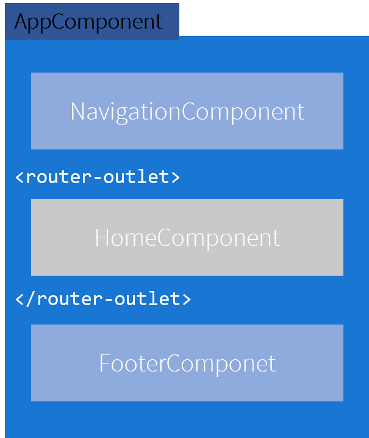
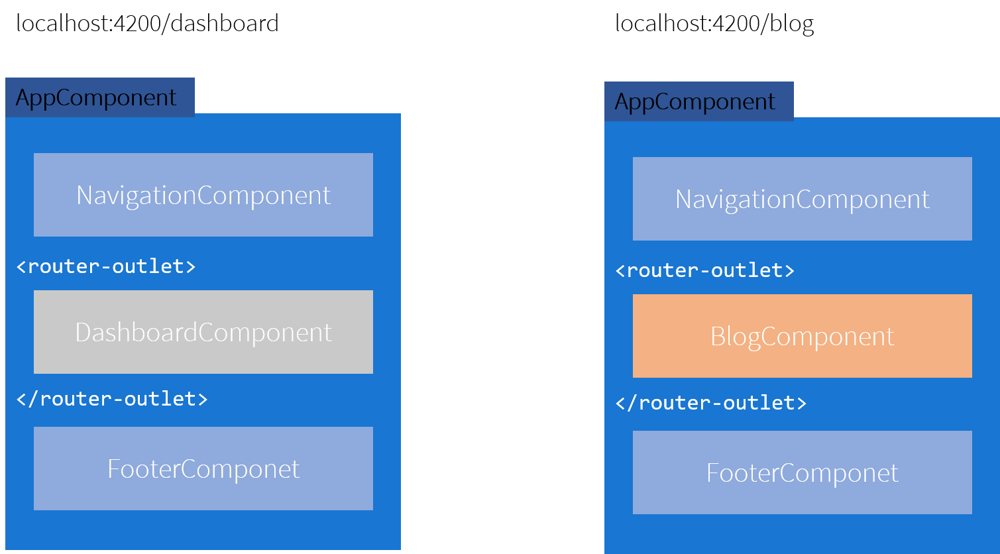
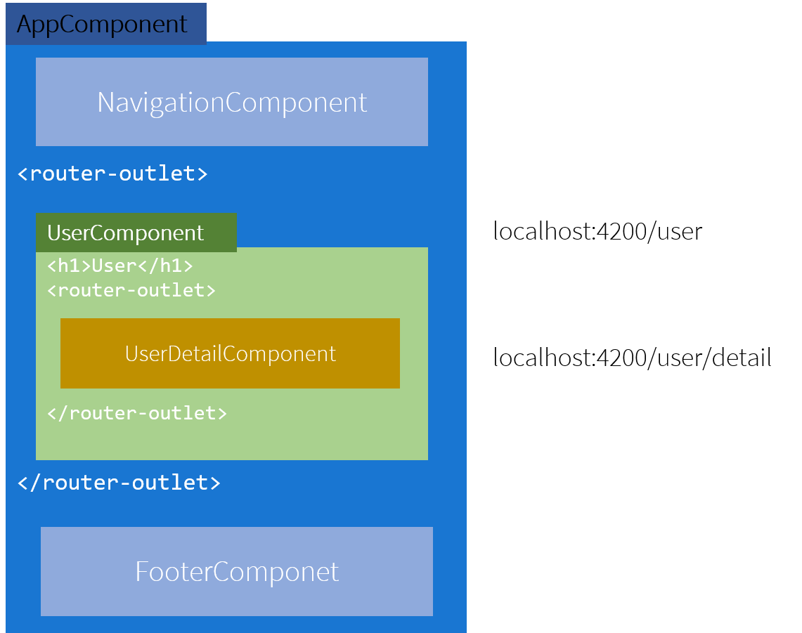

# Introduction to Routing in Angular

The [Angular router](https://angular.io/guide/router) is an indispensible part of the Angular plataform. It enables us to build powerful Single page application by managing the application navigation, enforcing route guards and facilitating lazy loading of modules.

## **How do routes work?**

An Angular application is a tree of components. Some of those components, such as the root component, will remain in place over the course of the application. However, we also want the ability to display certain components dynamically, and one way to achieve this is through use of the router. Using the router module along with router-outlet directives, it’s possible to define parts of our application which will display different sets of components based on the current url. Here you find more information of the [tree of components](https://blog.angularindepth.com/the-three-pillars-of-angular-routing-angular-router-series-introduction-fb34e4e8758e).

Lets grab as an example a simple page with a navigation bar, a body and a footer. 


We can think of this page as three distinct components over the root comoponent 



As we can see in between the navigation and footer which we dont expect to change we have the `<router-outlet>` tag. Inside of that we have a home component that represents the body of the application.

With the router we can dinamically set what is inside of the `router outlet` using a set of strategies that we will explore further. 

but for quick visual example think of it this way:



The `dashboard` route will display inside the `router outlet` the dashboard component and for the `blog` route would change the component inside the router outlet to display the blog component.

Pretty easy but how does it work and how do we do it ?

### **The Router Outlet**

Well lets first expain the `Router-Outlet`, which is a directive that’s available from the router library where the Router inserts the component that gets matched based on the current browser’s URL. You can add multiple outlets in your Angular application which enables you to implement advanced routing scenarios.

In our HTML we would find the folowing tag:
```html
<router-outlet></router-outlet>
```

Any component that gets matched by the Router will render it as a sibling of the Router outlet. A visual example wil be somthing like:



The main route is User inside of the user component we have another router to which we can match another route that would display the `UserDetailComponent`, by having the user/detail route.

---
## **Routes and Paths**

Routes are definitions (objects) comprised from at least a path and a component (or a redirectTo path) attributes. The path refers to the part of the URL that determines a unique view that should be displayed, and component refers to the Angular component that needs to be associated with a path. Based on a route definition that we provide (via a static `RouterModule.forRoot(routes)` method), the Router is able to navigate the user to a specific view.

Each `Route` maps a URL `path` to a component.

The `path` can be empty which denotes the `default path` of an application and it’s usually the start of the application.

The path can take a `wildcard string (**)`. The router will select this route if the requested URL doesn’t match any paths for the defined routes. This can be used for displaying a “Not Found” view or redirecting to a specific view if no match is found.

```ts
{ path:'contacts', component:ContactListComponent }
```

If this route definition is provided to the Router configuration, the router will render `ContactListComponent` when the browser URL for the web application becomes `/contacts`.

### Route matching strategies

The Angular Router provides different route matching strategies. The default strategy is simply checking if the current browser’s URL is prefixed with the `path`.

```ts
{ path:'contacts', component:ContactListComponent }
```

Could be also written as:

```ts
{ path:'contacts', pathMatch:'prefix', component:ContactListComponent }
```

The `patchMath` attribute specifies the matching strategy. In this case, it’s `prefix` which is the default.

The second  matching strategy is `full`. When it’s specified for a route, the router will check if the the path is exactly `equal` to the path of the current browser’s URL

```ts
{ path:'contacts', pathMatch:'full', component:ContactListComponent }
```

### Route Params

Creating routes with parameters is a common feature in web apps. Angular Router allows you to access parameters in different ways:

- Using the `ActivatedRoute` service
- Using the `ParamMap` observable available starting with v4.

You can create a route parameter using the `colon syntax`.

```ts
{ path:'contacts/:id', component:ContactDetailComponent }
```

---
## **Route Guards**

A route guard is a feature of the Angular Router that allows developers to run some logic when a route is requested, and based on that logic, it allows or denies the user access to the route. It’s commonly used to check if a user is logged in and has the authorization before he can access a page.

The router supports multiple guard interfaces:

- `CanActivate` to mediate navigation to a route.
- `CanActivateChild` to mediate navigation to a child route.
- `CanDeactivate` to mediate navigation away from the current route.
- `Resolve` to perform route data retrieval before route activation.
- `CanLoad` to mediate navigation to a feature module loaded asynchronously.

The router checks the `CanDeactivate` and `CanActivateChild` guards first, from the deepest child route to the top. Then it checks the `CanActivate` guards from the top down to the deepest child route. If the feature module is loaded asynchronously, the `CanLoad` guard is checked before the module is loaded. If any guard returns false, pending guards that have not completed will be canceled, and the entire navigation is canceled.

You can add a route guard by implementing the `CanActivate` interface available from the `@angular/router` package and extends the `canActivate()` method which holds the logic to allow or deny access to the route.

```ts
class MyGuard implements CanActivate {
  canActivate() {
    return true;
  }
}
```

You can then protect a route with the guard using the `canActivate` attribute

```ts
{ path:'contacts/:id', canActivate:[MyGuard], component:ContactDetailComponent }
```

### Navigation Directive

The Angular Router provides the routerLink directive to create navigation links. This directive takes the path associated with the component to navigate to.

```html
<a [routerLink]="'/contacts'" routerLinkActive="active">Contacts</a>
```

```html
<ul>
  <li *ngFor="let contact of contacts">
    <a [routerLink]="['/contacts',contact.id]" routerLinkActive="active"></a>
  </li>
</ul>
```

The `RouterLinkActive` directive toggles css classes for active RouterLink bindings based on the current `RouterState`.

---
## **Multiples outlets and auxiliary routes**

Angular Router supports multiple outlets in the same application.

A component has one associated primary route and can have auxiliary routes. Auxiliary routes enable developers to navigate multiple routes at the same time.

To create an auxiliary route, you’ll need a named router outlet where the component associated with the auxiliary route will be displayed.

```html
<router-outlet></router-outlet>

<router-outlet name="outlet1"></router-outlet>
```

- The outlet with no name is the primary outlet.

- All outlets should have a name except for the primary outlet.

You can then specify the outlet where you want to render your component using the outlet attribute

```ts
{ path: "contacts", component: ContactListComponent, outlet: "outlet1" }
```

For more examples we have the [routing-examples](routing-examples) project where multiple types of routing strategies are implemented.